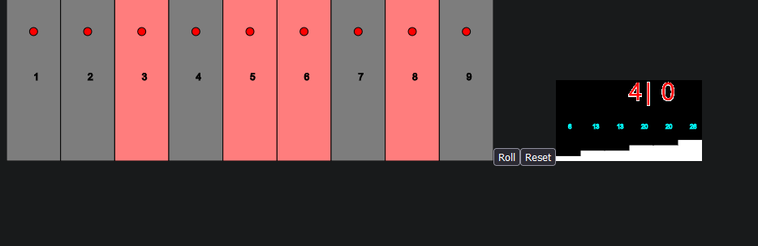

# Intro

This is my attempt on some table game where you roll two dices and attempt to mark all 9 bars which. You roll a dice, get a sum, and then select bars to match that sum.  

The bars on the right shows distribution for all rolled dices.  

I did try adding AI to it, but did not finish.

